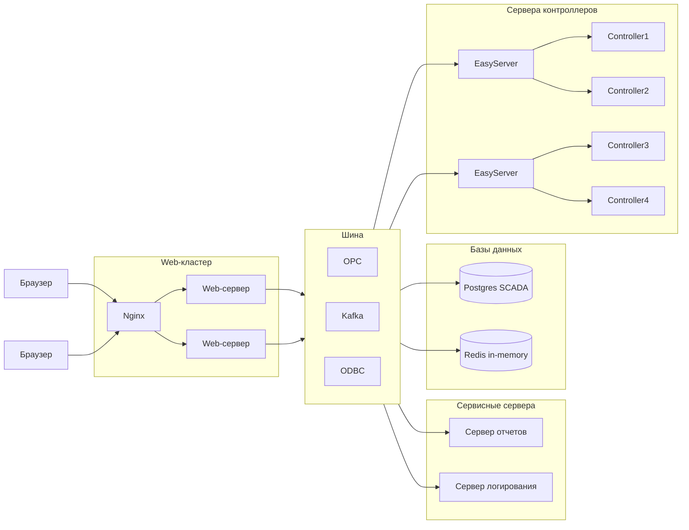

# SHnAPCS
Software and hardware new automated process control system

# Архитектурные требования к компонентам системы:
* сервер для работы с контроллером (на начальном этапе на базе EasyServer)
* сервер приложений для веб-клиентов (может горизонтально масштабироваться)
* веб-клиент для браузеров Chrome и Mozilla
* балансировщик нагрузки (Nginx)
* сервер отчетов
* сервер логирования

# Функциональные требования:
* поддержка faceplate для объектов
* наследование объектов
* группировка объектов
* объектная модель базы каналов, привязка тегов к объектам по шаблону
* история объекта (проигрыватель на основе протокола)
* возможность вносить изменения в контроллер во время его работы, без перезагрузки
* единая среда параллельной разработки проектов на базе веб-технологий, возможность одновременной работы над проектом нескольких инженеров
* поддержка скриптов для бизнес-логики (lua, java, js, python, jexl)
* поддержка языков программирования стандарта МЭК 6-1131/3 (ST, SFC, FBD)
* встроенный отладчик скриптов
* поддержка векторной графики
* расширяемая библиотека визуальных элементов управления
* кроссплатформенность решения
* поддержка протоколов: OPC-UA, Modbus, Snap7, Profinet
* импорт данных с EPLAN, добавление в EPLAN элементов управления
* компоновка и размещение классов проекта, трассировка связей между объектами на карте
* разрабока дополнительных сценариев работы с помощью макросов
* возможность создания генеративного дизайна
* возможность генерации кода по описанию с помощью ИИ
* выполнение проверок входных данных на стороне веб-сервера перед отправкой запроса контроллеру
* журнал событий
* генератор отчетов
* авторизация, уровень доступа, администрирование
* поддержка систем контроля версий проектов
* CI/CD, тестирование и быстрое развертывание проектов

# Задачи веб-клиента:
* мониторинг технологических процессов
* создание и редактирование проектов
* обмен данными с веб-сервером по REST API для запросов и через web-сокеты для оперативного обновления тегов

# Задачи веб-сервера:
* обработка stateless-запросов веб-клиентов на чтение и запись тегов проекта
* чтение и запись тегов OPC при взаимодействии с серверами контроллеров
* выполнение скриптов с бизнес-логикой (выполнение предварительных условий, обработка запросов на выполнение, выполнение сценариев, блокировка ресурсов)
* чтение и запись проектов в файловое хранилище с поддержкой контроля версий
* поддержка работы веб-редактора проектов (одновременная работа инженеров АСУТП над одним проектом, блокировка объектов над которыми ведется работа)
* редактирование базы каналов, импорт данных с EPLAN

# Задачи сервера для работы с контроллерами:
* чтение и запись тегов при работе с контроллерами
* чтение и запись тегов OPC при работе с веб-серверами
* чтение базы каналов

# Примеры open-source систем:
* FUXA (https://frangoteam.org/) 
* json-scada (https://github.com/riclolsen/json-scada) 
* https://github.com/SCADA-LTS/Scada-LTS 
* https://rapidscada.org/download-all-files/ https://github.com/RapidScada/scada-v6 
* https://github.com/GavinYellow/SharpSCADA 
* https://github.com/riclolsen/OSHMI

# Замечания по текущей SCADA:
1. Самое важное. Стабильная, корректная связь с оборудованием. Нареканий нет
2. Сохранение мпк в проекте. Неудобно хранить один компонент на все проекты, без возможности правок без пересохранения.
3. Дебаг, возможность корректной отладки.
4. Инспектор объектов - более удобный поиск объекта + имя свойств, а не только тега.
5. Возможность отмены действий
6. Возможно, более удобное редактирование функций проекта. в текущем варианте код для редактирования нужно открыть в конкретном обработчике и только там сохранить.
   

