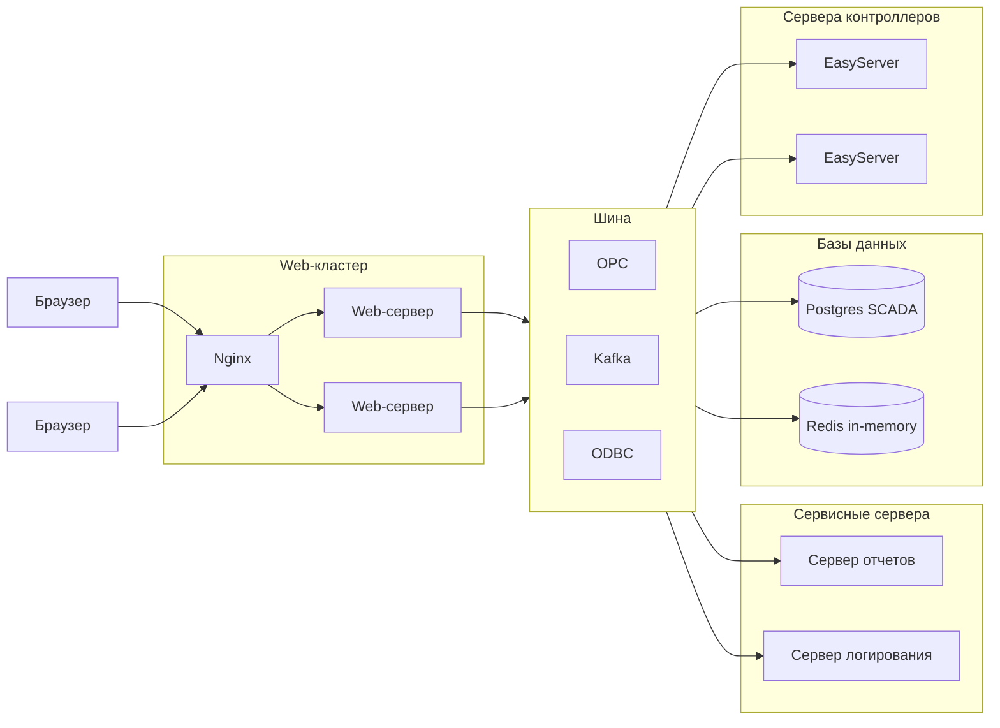

# SHnAPCS
Software and hardware new automated process control system

# Архитектурные требования к компонентам системы:
* сервер для работы с контроллером (на начальном этапе на базе EasyServer)
* сервер приложений для веб-клиентов (может горизонтально масштабироваться)
* веб-клиент для браузеров Chrome и Mozilla
* балансировщик нагрузки (Nginx)
* сервер отчетов
* сервер логирования

# Функциональные требования:
* поддержка faceplate для объектов
* наследование объектов
* группировка объектов
* объектная модель базы каналов
* история объекта (проигрыватель на основе протокола)
* единая среда параллельной разработки проектов на базе веб-технологий
* поддержка скриптов для бизнес-логики (lua, java, js, python, jexl)
* встроенный отладчик скриптов
* поддержка векторной графики
* расширяемая библиотека визуальных элементов управления
* кроссплатформенность решения
* поддержка протоколов: OPC-UA, Modbus, Snap7, Profinet
* импорт данных с EPLAN
* журнал событий
* генератор отчетов
* авторизация, уровень доступа, администрирование
* поддержка систем контроля версий проектов
* CI/CD, тестирование и быстрое развертывание проектов

# Примеры open-source систем:
* FUXA (https://frangoteam.org/) 
* json-scada (https://github.com/riclolsen/json-scada) 
* https://github.com/SCADA-LTS/Scada-LTS 
* https://rapidscada.org/download-all-files/ https://github.com/RapidScada/scada-v6 
* https://github.com/GavinYellow/SharpSCADA 
* https://github.com/riclolsen/OSHMI

