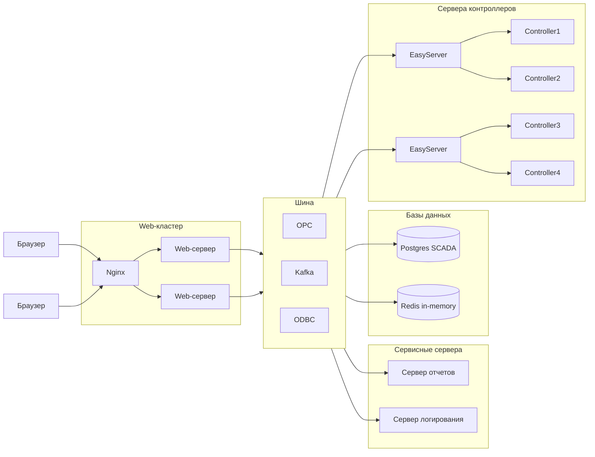

# Архитектурные требования к компонентам системы:
* сервер для работы с контроллером 
* сервер приложений для веб-клиентов (может горизонтально масштабироваться)
* веб-клиент для браузеров Chrome и Mozilla
* мобильный клиент
* балансировщик нагрузки (Nginx)
* сервер отчетов
* сервер логирования

# Задачи веб-клиента:
* мониторинг технологических процессов
* создание и редактирование проектов
* обмен данными с веб-сервером по REST API для запросов и через web-сокеты для оперативного обновления тегов

# Задачи веб-сервера:
* обработка stateless-запросов веб-клиентов на чтение и запись тегов проекта
* чтение и запись тегов OPC при взаимодействии с серверами контроллеров
* выполнение скриптов с бизнес-логикой (выполнение предварительных условий, обработка запросов на выполнение, выполнение сценариев, блокировка ресурсов)
* чтение и запись проектов в файловое хранилище с поддержкой контроля версий
* поддержка работы веб-редактора проектов (одновременная работа инженеров АСУТП над одним проектом, блокировка объектов над которыми ведется работа)
* редактирование базы каналов, импорт данных с EPLAN

# Задачи сервера для работы с контроллерами:
* чтение и запись тегов при работе с контроллерами
* чтение и запись тегов OPC при работе с веб-серверами
* чтение базы каналов

